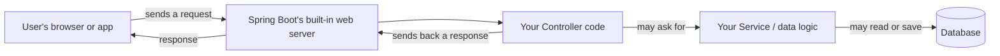

# Lesson 1: What is Spring Boot & why use it

*Estimated time: 15 minutes*

## What you'll learn

- What "Spring" and "Spring Boot" actually are, in plain words.
- What problem Spring Boot solves for you.
- Why so many real Java web applications are built with it.

There's no code in this lesson — it's all concept. That's on purpose:
before you type a single line, it helps to know *why* you're typing it.

## The concept (plain words)

**Spring** is a big toolbox of Java code that other people have already
written, tested, and shared, so you don't have to write it yourself. It
helps with things almost every application needs: talking to a database,
handling web requests, managing security, and more.

The catch with plain Spring is that using it means a lot of manual setup:
picking which pieces of the toolbox you need, wiring them together, and
writing configuration files by hand. For a beginner, that setup used to
take longer than actually building the app.

**Spring Boot** is a layer on top of Spring that removes almost all of
that manual setup. It makes sensible decisions for you automatically —
this is called "**convention over configuration**," which just means:
*Spring Boot assumes reasonable defaults, so you only have to change
things when you want something different from the default.*

Think of it like this:

- **Plain Spring** is a fully-stocked kitchen where you have to find
  every pot, pan, and ingredient yourself before you can start cooking.
- **Spring Boot** is that same kitchen, but with a starter kit already
  laid out on the counter for the dish you said you wanted to make. You
  can still swap ingredients, but you don't start from zero.

Concretely, Spring Boot gives you three things that matter a lot for a
beginner:

1. **Auto-configuration** — it looks at what's in your project and
   configures it sensibly on its own. Added a database driver? Spring
   Boot sets up the database connection for you.
2. **A built-in web server** — you don't need to install and configure a
   separate server program. Run your app, and it starts its own server.
   ("Server," here, just means the program that listens for requests
   coming in over the internet and sends back responses.)
3. **One command to run everything** — no complicated deployment steps
   to try things out while you're learning.

## How a request flows through a Spring Boot app

Here's the big picture of what happens when someone uses an app you've
built with Spring Boot. Don't worry about the details yet — you'll build
every piece of this in later lessons.

A **request** is just a question or instruction coming from outside your
app (for example, "give me the list of products" or "save this new
user"). Your app looks at the request, does whatever work is needed, and
sends back a **response** — usually some data or a confirmation. You'll
see this exact flow again in Lesson 5, once you're writing real code for
it.

## Why this matters

If you skip understanding *why* Spring Boot exists, its magic can feel
confusing later — like things are happening "automatically" for no
reason. Once you know that Spring Boot is just removing repetitive setup
work you'd otherwise have to do by hand, the rest of this tutorial will
make a lot more sense: every lesson is really about *what Spring Boot is
doing for you behind the scenes*.

## Try it yourself

This one's a thinking exercise, not a coding one:

Imagine you're building a simple app that lets people save and view a
list of books they've read. Write down (on paper, in a notes app,
wherever) a short list of the individual jobs your app would need to
handle — for example, "store the list of books somewhere" or "let someone
add a new book." Don't worry about *how* yet, just *what*.

??? note "Show solution"
    There's no single right answer, but a reasonable list looks like:

    - Listen for requests from a browser or app.
    - Show the current list of books.
    - Accept a new book someone wants to add.
    - Store books somewhere so they aren't lost when the app restarts.
    - Send back a confirmation or the updated list after a change.

    You'll notice this list matches the diagram above pretty closely —
    that's exactly what Spring Boot is built to help with, piece by
    piece, which is what the rest of this tutorial walks through.

## Checklist: before moving on

Before moving on, make sure you can...

- [ ] Explain, in your own words, the difference between Spring and
      Spring Boot.
- [ ] Say what "convention over configuration" means without looking it up.
- [ ] Describe, roughly, what happens between a user's request arriving
      and a response going back.

## What's next

In [Lesson 2](02-setting-up-environment.md), you'll install everything
you need on your computer and generate your first Spring Boot project
using a tool called Spring Initializr.
