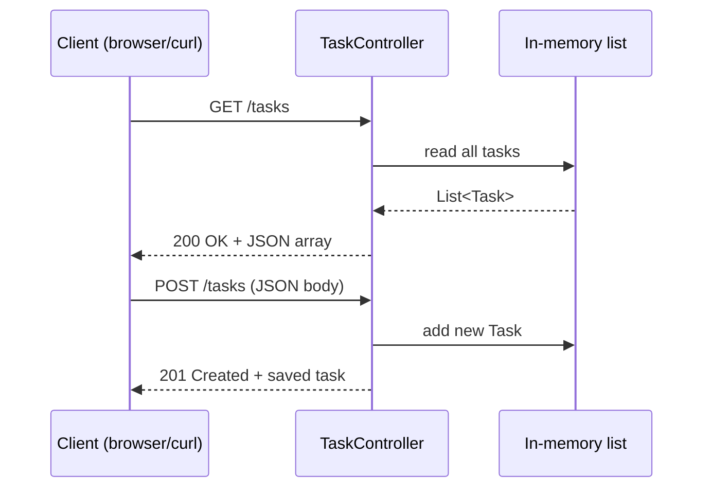

# Lesson 5: Building a REST API

*Estimated time: 30 minutes*

## What you'll learn

- What "REST API" actually means, in plain words.
- How to return a list of objects as JSON.
- How to read data a client sends you (a POST request) and use it.
- How to handle a "not found" case properly.

## The concept (plain words)

An **API** (Application Programming Interface) is just a set of URLs your
app responds to, meant to be used by *other programs* (a mobile app, a
frontend website, another service) rather than by a human clicking
around a page.

**REST** is a common style for designing APIs. You don't need to
memorize the theory — for this tutorial, "REST" just means:

- Each type of thing you're working with (tasks, users, products...) gets
  its own URL path, like `/tasks`.
- You use different **HTTP methods** to say what you want to do with it:
    - `GET` — read/fetch data (doesn't change anything).
    - `POST` — create something new.
    - (There's also `PUT`/`PATCH` for updating and `DELETE` for removing
      — we're keeping this lesson to GET and POST to stay focused.)
- Data is sent and received as **JSON** — a text format for structured
  data that looks like this: `{"id": 1, "title": "Learn Spring Boot"}`.

## The plan for this lesson

We'll build a small task list API with three endpoints:

| Method | Path | What it does |
|---|---|---|
| GET | `/tasks` | List all tasks |
| GET | `/tasks/{id}` | Get one task by id |
| POST | `/tasks` | Create a new task |



!!! tip
    The full working project is at
    [`code-examples/lesson-05-rest-api`](https://github.com/trishala23/SpringBootGuide/tree/main/code-examples/lesson-05-rest-api).

## Step 1: Create the `Task` class

This is a plain Java class describing what one task looks like:

```java
package com.example.demo;

public class Task {

    private Long id;
    private String title;
    private boolean done;

    public Task() {
    }

    public Task(Long id, String title, boolean done) {
        this.id = id;
        this.title = title;
        this.done = done;
    }

    // getters and setters for id, title, done
    // (see the full file in code-examples for all of them)
}
```

Spring Boot automatically converts objects like this to and from JSON
using a library called **Jackson** — you never write JSON-parsing code
by hand. The empty (no-argument) constructor exists specifically so
Jackson can build a `Task` object when it reads incoming JSON.

## Step 2: Return a list with GET /tasks

```java
@RestController
@RequestMapping("/tasks")
public class TaskController {

    private final List<Task> tasks = new ArrayList<>();
    private final AtomicLong nextId = new AtomicLong(1);

    public TaskController() {
        tasks.add(new Task(nextId.getAndIncrement(), "Learn Spring Boot", false));
        tasks.add(new Task(nextId.getAndIncrement(), "Build a REST API", false));
    }

    @GetMapping
    public List<Task> getAllTasks() {
        return tasks;
    }

}
```

`@RequestMapping("/tasks")` on the class sets a shared path prefix, so
`@GetMapping` (with no path given) here means "GET `/tasks`" exactly.
Returning a `List<Task>` is enough — Spring Boot turns it into a JSON
array automatically.

Run the app (`mvn spring-boot:run`) and visit
`http://localhost:8080/tasks` — you'll see:

```json
[
  {"id":1,"title":"Learn Spring Boot","done":false},
  {"id":2,"title":"Build a REST API","done":false}
]
```

## Step 3: Get one task with GET /tasks/{id}

```java
@GetMapping("/{id}")
public ResponseEntity<Task> getTask(@PathVariable Long id) {
    Optional<Task> found = tasks.stream()
            .filter(task -> task.getId().equals(id))
            .findFirst();

    return found
            .map(ResponseEntity::ok)
            .orElseGet(() -> ResponseEntity.notFound().build());
}
```

`ResponseEntity<Task>` lets us control the **status code**, not just the
data. A status code is a short number telling the client how the request
went — `200` means "OK, here's your data," `404` means "not found." Here,
if no task matches the id, we return a proper `404` instead of an empty
or broken response. We'll build a cleaner, reusable way to do this in
Lesson 9 (error handling) — this is the manual version so you can see
what's really happening first.

## Step 4: Accept new data with POST /tasks

```java
@PostMapping
public ResponseEntity<Task> createTask(@RequestBody Task newTask) {
    newTask.setId(nextId.getAndIncrement());
    tasks.add(newTask);
    return ResponseEntity.status(HttpStatus.CREATED).body(newTask);
}
```

`@RequestBody Task newTask` tells Spring Boot: "take the JSON in the
request's body and turn it into a `Task` object for me." We then assign
it a fresh id (so clients can't pick their own) and store it.
`HttpStatus.CREATED` is status code `201`, the conventional "something
new was successfully created" response.

Test it with `curl` (or any API testing tool you like):

```bash
curl -X POST http://localhost:8080/tasks \
  -H "Content-Type: application/json" \
  -d '{"title":"Write tests","done":false}'
```

You should get back the saved task, now with an `id`:

```json
{"id":3,"title":"Write tests","done":false}
```

`-H "Content-Type: application/json"` tells the server "the body I'm
sending is JSON" — without it, Spring Boot won't know how to parse it.

## Why this matters

Almost every real application — mobile apps, single-page websites,
integrations between companies — talks to a backend through a REST-style
API just like this one. Once GET and POST feel natural, PUT, PATCH, and
DELETE (updating and deleting) are the same pattern with tiny variations,
and you'll be able to pick them up in minutes when you need them.

## Try it yourself

Add a `DELETE /tasks/{id}` endpoint that removes a task by id and returns
`204 No Content` (meaning "success, nothing to send back") — or `404` if
the id doesn't exist.

??? note "Show solution"
    ```java
    import org.springframework.web.bind.annotation.DeleteMapping;

    @DeleteMapping("/{id}")
    public ResponseEntity<Void> deleteTask(@PathVariable Long id) {
        boolean removed = tasks.removeIf(task -> task.getId().equals(id));

        if (removed) {
            return ResponseEntity.noContent().build();
        }
        return ResponseEntity.notFound().build();
    }
    ```

    `removeIf` returns `true` if something was actually removed, which is
    a convenient way to know whether the id existed at all.
    `ResponseEntity.noContent()` builds the `204` response — note the
    generic type is `Void`, since there's no body to send back.

## Checklist: before moving on

Before moving on, make sure you can...

- [ ] Explain what GET and POST are each normally used for.
- [ ] Explain what `@RequestBody` and `@PathVariable` each do.
- [ ] Use `curl` (or a similar tool) to send both a GET and a POST request
      to your running app.
- [ ] Say what status code `404` and `201` each mean.

## What's next

In [Lesson 6](06-in-memory-data.md), we'll give this in-memory task list
a proper home — a dedicated storage class — instead of keeping it
directly inside the controller.
