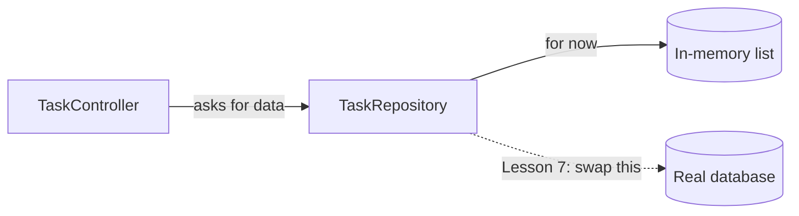

# Lesson 6: Working with data (in-memory first)

*Estimated time: 25 minutes*

## What you'll learn

- Why data storage shouldn't live directly inside a controller.
- What a "repository" is, in plain words.
- What "dependency injection" actually means, and why it's useful.

## The concept (plain words)

In Lesson 5, the task list lived directly inside `TaskController`. That
works for a tiny example, but it mixes two different jobs into one
class: *handling web requests* and *storing data*. As an app grows, that
mix gets messy fast — and it makes it hard to swap out how data is stored
later (which is exactly what we'll do in Lesson 7).

The fix is to give storage its own class. In Spring Boot, a class whose
job is "store and retrieve data" is conventionally called a
**repository**.



The controller doesn't need to know *how* the repository stores tasks —
just that it can ask for them. That's the whole point: swapping the
inside of the box in Lesson 7 won't require changing the controller at
all.

## Dependency injection, explained simply

Here's the part that trips up a lot of beginners, explained as plainly as
possible: normally, if class A needs class B, you'd write
`new B()` inside class A. **Dependency injection** flips that around:
class A just says "I need a B" (usually as a constructor parameter), and
Spring creates the B and hands it over automatically.

```java
public TaskController(TaskRepository taskRepository) {
    this.taskRepository = taskRepository;
}
```

Spring sees that `TaskController` needs a `TaskRepository`, notices
there's exactly one class marked `@Repository` (our `TaskRepository`),
creates it, and passes it into the controller's constructor when the app
starts — all automatically. You never write `new TaskRepository()`
yourself. This is why Lesson 1 called Spring Boot's setup work
"automatic": this wiring is a big part of what it's doing for you.

## Step 1: Organize into packages

We'll split our one package into three, each with one job:

```
com.example.demo.model         <- what a Task looks like
com.example.demo.repository    <- where tasks are stored
com.example.demo.controller    <- handles web requests
```

This is a very common structure in real Spring Boot apps — recognizing
it will help you navigate other people's projects too.

## Step 2: Move `Task` into `model`

Same class as Lesson 5, just moved to `com.example.demo.model`:

```java
package com.example.demo.model;

public class Task {
    private Long id;
    private String title;
    private boolean done;
    // constructors, getters, setters - unchanged from Lesson 5
}
```

## Step 3: Create `TaskRepository`

```java
package com.example.demo.repository;

import com.example.demo.model.Task;
import org.springframework.stereotype.Repository;
import java.util.*;
import java.util.concurrent.atomic.AtomicLong;

@Repository
public class TaskRepository {

    private final List<Task> tasks = new ArrayList<>();
    private final AtomicLong nextId = new AtomicLong(1);

    public TaskRepository() {
        save(new Task(null, "Learn Spring Boot", false));
        save(new Task(null, "Build a REST API", false));
    }

    public List<Task> findAll() {
        return tasks;
    }

    public Optional<Task> findById(Long id) {
        return tasks.stream()
                .filter(task -> task.getId().equals(id))
                .findFirst();
    }

    public Task save(Task task) {
        if (task.getId() == null) {
            task.setId(nextId.getAndIncrement());
            tasks.add(task);
        } else {
            tasks.removeIf(existing -> existing.getId().equals(task.getId()));
            tasks.add(task);
        }
        return task;
    }

    public boolean deleteById(Long id) {
        return tasks.removeIf(task -> task.getId().equals(id));
    }

}
```

`@Repository` is a **stereotype annotation** — a label that both (a)
makes Spring create and manage one instance of this class automatically,
and (b) documents, just by reading the code, "this class's job is data
access." `save` does double duty: if the task has no `id` yet, it's new,
so we assign one; otherwise, we replace the existing task with the
updated version.

## Step 4: Slim down `TaskController`

```java
package com.example.demo.controller;

import com.example.demo.model.Task;
import com.example.demo.repository.TaskRepository;
import org.springframework.http.HttpStatus;
import org.springframework.http.ResponseEntity;
import org.springframework.web.bind.annotation.*;
import java.util.List;

@RestController
@RequestMapping("/tasks")
public class TaskController {

    private final TaskRepository taskRepository;

    public TaskController(TaskRepository taskRepository) {
        this.taskRepository = taskRepository;
    }

    @GetMapping
    public List<Task> getAllTasks() {
        return taskRepository.findAll();
    }

    @GetMapping("/{id}")
    public ResponseEntity<Task> getTask(@PathVariable Long id) {
        return taskRepository.findById(id)
                .map(ResponseEntity::ok)
                .orElseGet(() -> ResponseEntity.notFound().build());
    }

    @PostMapping
    public ResponseEntity<Task> createTask(@RequestBody Task newTask) {
        Task saved = taskRepository.save(newTask);
        return ResponseEntity.status(HttpStatus.CREATED).body(saved);
    }

}
```

Notice the controller is now entirely about *handling HTTP requests* —
no list, no id generation. All of that lives in `TaskRepository` now.

!!! tip
    The complete project, including a `DELETE /tasks/{id}` endpoint, is at
    [`code-examples/lesson-06-in-memory-data`](https://github.com/trishala23/SpringBootGuide/tree/main/code-examples/lesson-06-in-memory-data).

## Why this matters

Separating "handling requests" from "storing data" is one of the most
useful habits you can build early. It keeps each class small and focused,
makes testing easier (you can test storage logic without starting a web
server), and — as you're about to see in Lesson 7 — lets you replace how
data is stored without touching your controllers at all.

## Try it yourself

Add an `update(Long id, Task updatedTask)` method to `TaskRepository`
that replaces an existing task's title/done values (keeping the same
id), and wire up a `PUT /tasks/{id}` endpoint in the controller that uses
it. Return `404` if the id doesn't exist.

??? note "Show solution"
    In `TaskRepository`:

    ```java
    public Optional<Task> update(Long id, Task updatedTask) {
        return findById(id).map(existing -> {
            existing.setTitle(updatedTask.getTitle());
            existing.setDone(updatedTask.isDone());
            return existing;
        });
    }
    ```

    In `TaskController`:

    ```java
    @PutMapping("/{id}")
    public ResponseEntity<Task> updateTask(@PathVariable Long id, @RequestBody Task updatedTask) {
        return taskRepository.update(id, updatedTask)
                .map(ResponseEntity::ok)
                .orElseGet(() -> ResponseEntity.notFound().build());
    }
    ```

    Reusing `findById` inside `update` keeps the "task not found" logic
    in one place instead of repeating it.

## Checklist: before moving on

Before moving on, make sure you can...

- [ ] Explain why splitting storage out of the controller is useful.
- [ ] Explain dependency injection in your own words, without saying
      "magic."
- [ ] Say what `@Repository` does.
- [ ] Point to which class in your project is responsible for storing
      data, versus which one handles web requests.

## What's next

In [Lesson 7](07-database.md), we replace the inside of `TaskRepository`
with a real database — and thanks to today's split, our controller
won't need to change.
