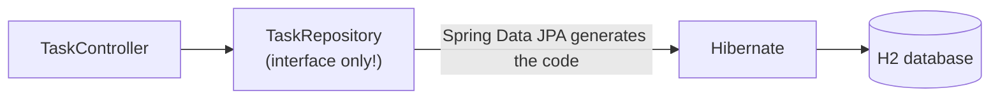

# Lesson 7: Connecting to a real database

*Estimated time: 30 minutes*

## What you'll learn

- What Spring Data JPA is and the problem it solves.
- How to turn `Task` into something stored in a real database table.
- How little code you need to write, thanks to Lesson 6's split between
  controller and repository.

## The concept (plain words)

So far, restarting the app has wiped out every task — everything lived
in a plain Java list. Real apps need data that survives restarts, which
means storing it in an actual **database**.

**JPA** (Java Persistence API) is a standard way for Java code to talk to
a relational database (a database organized into tables, rows, and
columns) without writing raw SQL for every single operation. **Spring
Data JPA** builds on top of that: you write an interface describing what
you want to do, and Spring generates the actual implementation for you at
startup.

We'll use **H2**, a real relational database that runs entirely inside
your app's memory — no separate install, no server to run, perfect for
learning. At the very end of this lesson, we'll show exactly what changes
if you want to point at a real PostgreSQL database instead.



!!! tip
    The full working project is at
    [`code-examples/lesson-07-database`](https://github.com/trishala23/SpringBootGuide/tree/main/code-examples/lesson-07-database).

## Step 1: Add the dependencies

In `pom.xml`:

```xml
<dependency>
    <groupId>org.springframework.boot</groupId>
    <artifactId>spring-boot-starter-data-jpa</artifactId>
</dependency>

<dependency>
    <groupId>com.h2database</groupId>
    <artifactId>h2</artifactId>
    <scope>runtime</scope>
</dependency>
```

(If generating fresh from Spring Initializr, just tick **Spring Data JPA**
and **H2 Database** as dependencies instead.)

## Step 2: Turn `Task` into a database entity

```java
package com.example.demo.model;

import jakarta.persistence.Entity;
import jakarta.persistence.GeneratedValue;
import jakarta.persistence.GenerationType;
import jakarta.persistence.Id;

@Entity
public class Task {

    @Id
    @GeneratedValue(strategy = GenerationType.IDENTITY)
    private Long id;

    private String title;
    private boolean done;

    // constructors, getters, setters
}
```

`@Entity` tells Spring Data JPA "this class maps to a database table" —
by default, a table named `task` with a column per field. `@Id` marks
which field is the primary key (the unique identifier for each row), and
`@GeneratedValue` says "let the database assign new ids automatically,"
instead of us picking them by hand like we did in Lesson 6.

## Step 3: Replace the repository's insides

This is the part that tends to surprise beginners the first time they
see it:

```java
package com.example.demo.repository;

import com.example.demo.model.Task;
import org.springframework.data.jpa.repository.JpaRepository;

public interface TaskRepository extends JpaRepository<Task, Long> {
}
```

That's the *entire file*. No class body, no method implementations. By
extending `JpaRepository<Task, Long>` (`Task` is the entity type, `Long`
is its id type), Spring Data JPA generates a working implementation for
you at startup — `findAll()`, `findById(id)`, `save(entity)`,
`deleteById(id)`, `existsById(id)`, and more.

## Step 4: The controller barely changes

Because Lesson 6 already had the controller talk to `TaskRepository`
through methods like `findAll()` and `save()`, almost nothing here
changes — we just tighten up `deleteTask` slightly, since
`JpaRepository`'s `deleteById` doesn't tell us whether something was
actually deleted:

```java
@DeleteMapping("/{id}")
public ResponseEntity<Void> deleteTask(@PathVariable Long id) {
    if (!taskRepository.existsById(id)) {
        return ResponseEntity.notFound().build();
    }
    taskRepository.deleteById(id);
    return ResponseEntity.noContent().build();
}
```

This is exactly what Lesson 6 promised: swap what's *inside* the box, and
the rest of the app is barely affected.

## Step 5: Configure the database connection

In `application.properties`:

```properties
spring.datasource.url=jdbc:h2:mem:tasksdb;DB_CLOSE_DELAY=-1
spring.datasource.driver-class-name=org.h2.Driver
spring.datasource.username=sa
spring.datasource.password=

spring.jpa.hibernate.ddl-auto=update
spring.h2.console.enabled=true
```

- `spring.datasource.url` — where the database lives. `jdbc:h2:mem:tasksdb`
  means "an in-memory H2 database named `tasksdb`."
- `spring.jpa.hibernate.ddl-auto=update` — automatically create/update
  database tables to match your `@Entity` classes. **Convenient for
  learning, but never use this in a real production app** — there, table
  changes should go through reviewed, version-controlled migration
  scripts instead, so nothing gets silently altered or dropped.
- `spring.h2.console.enabled=true` — turns on a web page at
  `http://localhost:8080/h2-console` where you can browse the actual
  database tables and run SQL. When it opens, use the exact JDBC URL from
  above (`jdbc:h2:mem:tasksdb`) to connect.

Run the app and hit the same endpoints as Lesson 6 — they work exactly
the same from the outside, but now the code is backed by a real
database (until you restart the app, since H2 here only lives in
memory — Lesson 11 touches on more permanent options).

## Swapping to PostgreSQL later

When you're ready for a database that survives restarts, the *code*
above doesn't change at all — only the dependency and configuration do:

```xml
<dependency>
    <groupId>org.postgresql</groupId>
    <artifactId>postgresql</artifactId>
    <scope>runtime</scope>
</dependency>
```

```properties
spring.datasource.url=jdbc:postgresql://localhost:5432/tasksdb
spring.datasource.username=your_username
spring.datasource.password=your_password
```

That's the entire migration — proof that separating storage behind a
repository (Lesson 6) really does pay off.

## Why this matters

This is the biggest "wow" moment in the whole tutorial: an empty
interface gave you a fully working database layer. That's Spring Boot's
philosophy from Lesson 1 taken to its logical extreme — sensible
defaults, minimal code, and you only step in when you need something
different from the default.

## Try it yourself

Add a `List<Task> findByDoneFalse()` method to `TaskRepository`, and a
`GET /tasks/pending` endpoint that returns only tasks that aren't done
yet.

Hint: Spring Data JPA can generate queries just from a method's *name* —
no SQL required.

??? note "Show solution"
    In `TaskRepository`:

    ```java
    public interface TaskRepository extends JpaRepository<Task, Long> {
        List<Task> findByDoneFalse();
    }
    ```

    In `TaskController`:

    ```java
    @GetMapping("/pending")
    public List<Task> getPendingTasks() {
        return taskRepository.findByDoneFalse();
    }
    ```

    Spring Data JPA reads the method name `findByDoneFalse` and builds
    the matching SQL query itself — `done` matches the entity's `done`
    field, and `False` means "where this is false." This is called a
    **derived query method**: as long as you follow the naming pattern,
    you don't write the query by hand.

    !!! warning "Route ordering"
        A request to `/tasks/pending` could match either `getTask(@PathVariable Long id)`
        (with `id` = the text `"pending"`) or your new `getPendingTasks()`
        method. Spring Boot picks the more specific, literal path over
        the `{id}` pattern regardless of declaration order, so this
        works correctly either way — but it's still worth knowing that a
        path variable route and a literal route can overlap like this,
        since it's a common source of confusion in bigger APIs.

## Checklist: before moving on

Before moving on, make sure you can...

- [ ] Explain what `@Entity` and `@Id` do.
- [ ] Explain why `TaskRepository` needs no method implementations.
- [ ] Say what `spring.jpa.hibernate.ddl-auto=update` does, and why it's
      risky in production.
- [ ] Open `http://localhost:8080/h2-console` and see your task rows.

## What's next

In Lesson 8, we'll look at `application.properties` more closely — what
else you can configure, and how `application.yml` compares.
