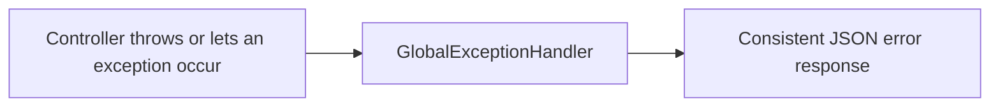

# Lesson 9: Error handling basics

*Estimated time: 25 minutes*

## What you'll learn

- Why scattering `if (not found) return 404` checks everywhere gets
  messy.
- How to handle errors from one central place with `@RestControllerAdvice`.
- How to validate incoming data automatically, with clear error messages.

## The concept (plain words)

Back in Lesson 5, `getTask` manually built a 404 response when a task
wasn't found:

```java
return found
        .map(ResponseEntity::ok)
        .orElseGet(() -> ResponseEntity.notFound().build());
```

That's fine for one method. But once you have many endpoints, each
needing its own "what if this fails" logic, that pattern gets repeated
everywhere and starts to drift — one endpoint returns a plain 404, another
returns a JSON message, another forgets the check entirely.

Spring Boot's answer is to let your code **throw an exception** the
moment something's wrong, and handle *every* exception of a given type
in exactly one place. This lesson builds that up in three pieces:



!!! tip
    The full working project is at
    [`code-examples/lesson-09-error-handling`](https://github.com/trishala23/SpringBootGuide/tree/main/code-examples/lesson-09-error-handling).

## Step 1: A custom exception

```java
package com.example.demo.exception;

public class TaskNotFoundException extends RuntimeException {
    public TaskNotFoundException(Long id) {
        super("Task not found with id: " + id);
    }
}
```

A **custom exception** is just a plain Java class that extends
`RuntimeException`, giving it a name that says exactly what went wrong —
much clearer than a generic error somewhere in the code.

## Step 2: A consistent error shape

```java
package com.example.demo.exception;

import com.fasterxml.jackson.annotation.JsonInclude;
import java.time.Instant;
import java.util.Map;

@JsonInclude(JsonInclude.Include.NON_NULL)
public class ErrorResponse {
    private final Instant timestamp = Instant.now();
    private final int status;
    private final String message;
    private final Map<String, String> fieldErrors;

    // constructors, getters (see full file in code-examples)
}
```

Every error this API returns will look the same shape — a timestamp, a
status code, a message, and (when relevant) which fields failed
validation. Clients calling your API only need to learn one error format,
not one per endpoint.

## Step 3: Handle exceptions in one place

```java
package com.example.demo.exception;

import org.springframework.http.HttpStatus;
import org.springframework.http.ResponseEntity;
import org.springframework.web.bind.annotation.ExceptionHandler;
import org.springframework.web.bind.annotation.RestControllerAdvice;

@RestControllerAdvice
public class GlobalExceptionHandler {

    @ExceptionHandler(TaskNotFoundException.class)
    public ResponseEntity<ErrorResponse> handleTaskNotFound(TaskNotFoundException ex) {
        ErrorResponse body = new ErrorResponse(HttpStatus.NOT_FOUND.value(), ex.getMessage());
        return ResponseEntity.status(HttpStatus.NOT_FOUND).body(body);
    }

}
```

`@RestControllerAdvice` watches *every* controller in your app.
`@ExceptionHandler(TaskNotFoundException.class)` says "whenever any
controller lets a `TaskNotFoundException` escape, run this method
instead of returning a raw stack trace." Now the controller can be this
simple:

```java
@GetMapping("/{id}")
public Task getTask(@PathVariable Long id) {
    return taskRepository.findById(id)
            .orElseThrow(() -> new TaskNotFoundException(id));
}
```

No `ResponseEntity`, no manual 404 building — just "get the task, or
throw." The controller's job is describing the happy path; the exception
handler's job is describing what error responses look like.

## Step 4: Validate incoming data automatically

Add a dependency to `pom.xml`:

```xml
<dependency>
    <groupId>org.springframework.boot</groupId>
    <artifactId>spring-boot-starter-validation</artifactId>
</dependency>
```

Annotate the field that must always have a value:

```java
@NotBlank(message = "title must not be blank")
private String title;
```

Then tell the controller to check it, using `@Valid`:

```java
@PostMapping
public ResponseEntity<Task> createTask(@Valid @RequestBody Task newTask) {
    Task saved = taskRepository.save(newTask);
    return ResponseEntity.status(HttpStatus.CREATED).body(saved);
}
```

If `title` is missing or blank, Spring Boot throws
`MethodArgumentNotValidException` automatically — `createTask`'s body
never even runs. Handle it the same way as before:

```java
@ExceptionHandler(MethodArgumentNotValidException.class)
public ResponseEntity<ErrorResponse> handleValidation(MethodArgumentNotValidException ex) {
    Map<String, String> fieldErrors = new LinkedHashMap<>();
    ex.getBindingResult().getFieldErrors().forEach(
            error -> fieldErrors.put(error.getField(), error.getDefaultMessage())
    );

    ErrorResponse body = new ErrorResponse(HttpStatus.BAD_REQUEST.value(), "Validation failed", fieldErrors);
    return ResponseEntity.status(HttpStatus.BAD_REQUEST).body(body);
}
```

Try posting an empty title:

```bash
curl -X POST http://localhost:8080/tasks \
  -H "Content-Type: application/json" \
  -d '{"title":"","done":false}'
```

```json
{
  "timestamp": "2026-01-15T10:00:00Z",
  "status": 400,
  "message": "Validation failed",
  "fieldErrors": { "title": "title must not be blank" }
}
```

## A safety net for the unexpected

Finally, add one broad handler for anything you didn't specifically plan
for — much better than leaking an internal stack trace to whoever's
calling your API:

```java
@ExceptionHandler(Exception.class)
public ResponseEntity<ErrorResponse> handleUnexpected(Exception ex) {
    ErrorResponse body = new ErrorResponse(
            HttpStatus.INTERNAL_SERVER_ERROR.value(),
            "Something went wrong. Please try again later."
    );
    return ResponseEntity.status(HttpStatus.INTERNAL_SERVER_ERROR).body(body);
}
```

## Why this matters

Centralizing error handling keeps controllers focused on the happy path,
guarantees every error response looks the same to whoever's calling your
API, and means you only have to fix an error format in one place instead
of hunting through every endpoint.

## Try it yourself

Add a `TaskAlreadyDoneException` and throw it from a new
`PATCH /tasks/{id}/complete` endpoint if the task is already marked
`done` — otherwise mark it done and save it. Handle the new exception in
`GlobalExceptionHandler` with a `409 Conflict` status.

??? note "Show solution"
    New exception:

    ```java
    public class TaskAlreadyDoneException extends RuntimeException {
        public TaskAlreadyDoneException(Long id) {
            super("Task " + id + " is already marked done");
        }
    }
    ```

    In `TaskController`:

    ```java
    @PatchMapping("/{id}/complete")
    public Task completeTask(@PathVariable Long id) {
        Task task = taskRepository.findById(id)
                .orElseThrow(() -> new TaskNotFoundException(id));

        if (task.isDone()) {
            throw new TaskAlreadyDoneException(id);
        }

        task.setDone(true);
        return taskRepository.save(task);
    }
    ```

    In `GlobalExceptionHandler`:

    ```java
    @ExceptionHandler(TaskAlreadyDoneException.class)
    public ResponseEntity<ErrorResponse> handleAlreadyDone(TaskAlreadyDoneException ex) {
        ErrorResponse body = new ErrorResponse(HttpStatus.CONFLICT.value(), ex.getMessage());
        return ResponseEntity.status(HttpStatus.CONFLICT).body(body);
    }
    ```

    `409 Conflict` is the conventional status for "this request makes
    sense, but it conflicts with the current state of the resource" —
    exactly the case here.

## Checklist: before moving on

Before moving on, make sure you can...

- [ ] Explain why centralizing error handling is better than repeating
      checks in every endpoint.
- [ ] Explain what `@RestControllerAdvice` and `@ExceptionHandler` each do.
- [ ] Add a validation annotation to a field and see it produce a 400
      response with a clear message.
- [ ] Say what a fallback `@ExceptionHandler(Exception.class)` protects
      against.

## What's next

In [Lesson 10](10-testing.md), we'll write real tests for this app —
checking that a missing task actually returns 404, and that validation
actually rejects bad input, instead of just trusting it by eye.
